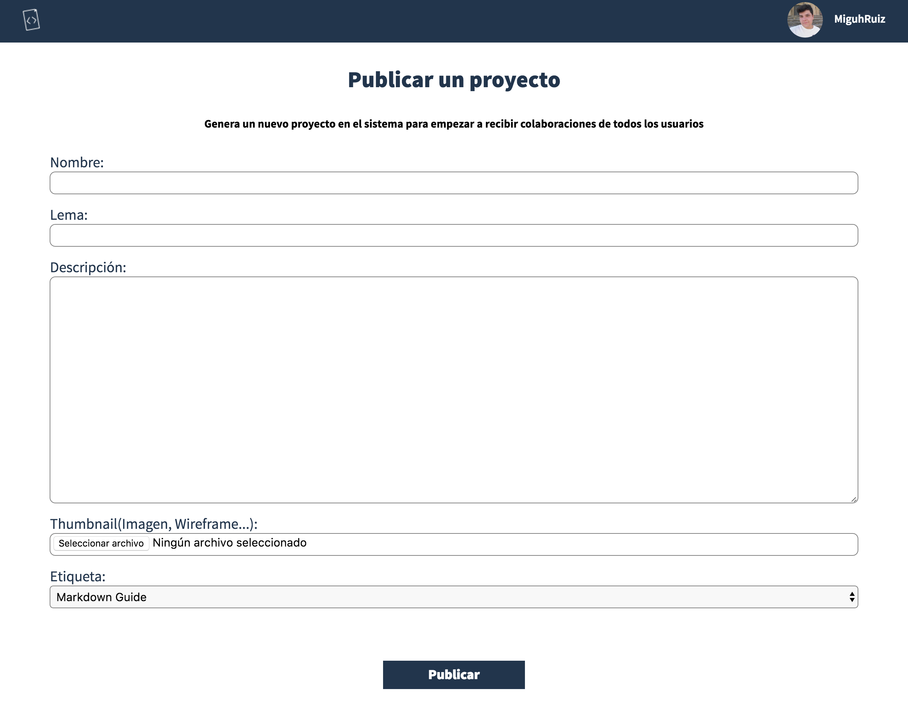

# Crear una idea: La máquina que mueve Better Code

Nos congratula ver que te has decidido por crear una idea en Better Code :smile:, gracias a ti la comunidad irá creciendo poco a poco.

En esta guía vamos a llevarte paso a paso por el proceso de crear una idea así como que estás haciendo en cada acción:

## Rellenando el formulario para crear una idea

Para acceder al formulario que te permitirá crear una idea solo tienes que posicionarte en cualquier vista de las que hemos estado comentando antes y hacer click en el botón situado en la esquina inferior derecha:

Una vez que estés en la vista de creación de ideas rellena este lindo formulario:

Te explico la totalidad de los campos, por si tienes algún problema:

* **Nombre:** El nombre de tu idea. Por ejemplo, GitHub.

* **Lema:** La frase que identificará a tu aplicación. Esta irá después del título en algunas vistas(Tal que así: **GitHub: How People Build Software**). Por ejemplo, How People Build Software.

* **Descripción:** Indica detalles sobre la aplicación, te recomendamos que también añadas algunos perfiles técnicos de los colaboradores para llegar a el profesional correcto. Por ejemplo: Imagina Git en la nube. Es lo que queremos hacer. Necesitamos principalmente desarrolladores en Ruby aunque si estás interesado en unirte el único requerimiento son las ganas, ¡Bienvenido!

* **Thumbnail:** La imagen de tu aplicación, esta aparecerá en todas las vistas así que usa una que sea agradable a la vista y que muestre algo de nuestra aplicación.

* **Etiqueta:** Selecciona entre una de las listadas, nos gusta organizar bien todas las ideas para poder construir nuevas funciones como pueden ser la búsqueda por lenguajes.

## ¿Qué implica haber creado una idea? Siguientes pasos

Una vez que hayas creado una idea debes de tener en cuenta lo que has creado:

* Un espacio en Better Code: En el que colaboradores podrán unirse a tu idea.

* Un repositorio en GitHub: localizado en la organización `BetterCodeHQ`, la cual eres parte desde que te registarte. Nosotros ya te hemos añadido una licencia MIT. Te recomendamos que tu añadas lo siguiente:

  * Un **CONTRIBUTING.md** en el que cuentes las directrices a seguir para la gente que se una al proyecto.

  * **Algunos issues** en los que añadas algunas tareas que hay que hacer en el proyecto.

  * Algunos commits en los que ya hayas creado tu la base del proyecto.

## Preguntas frecuentes a la hora de crear una idea

> **El tag que identifica a mi proyecto no está en la lista, ¿Qué puedo hacer?**

>En este momento tenemos muy pocos tags ya que venimos de una beta privada. Si el tag que buscas no está [contáctanos](#) y nosotros encantados lo añadimos.
