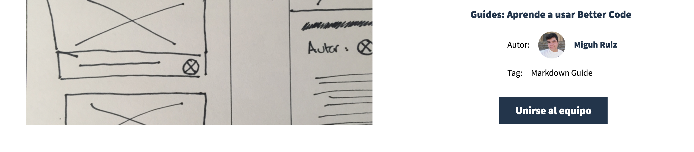
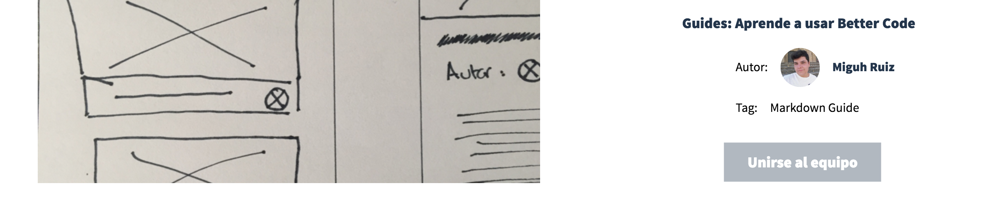

# Comienza a colaborar en equipo: Únete a una idea existente en la aplicación.

Si viste un proyecto que te enamoró :heart_eyes: está decidido, tienes que colaborar en el. Es muy simple, solo tienes que ir a la [vista de proyecto](#) y hacer click en el botón que dice `Unirse al equipo`:

Tras esto debes de recibir en tu email la perceptiva notificación de GitHub notificando de que has obtenido acceso al repositorio gracias a nuestra [integración con GitHub](#).

### No puedo unirme al proyecto: Veo el botón gris.

Si en vez de salirte el proyecto como en la imagen superior ves el **botón en gris significa que ya estás en el proyecto**, no tienes nada más que hacer. Puedes empezar a colaborar.

### No puedo unirme al proyecto: Me sale un mensaje de error.

Si al intentar unirte recibes una notificación de error(caraterizada por estar en un fondo rojo) puede que estés experimentado un problema de la API de Github. Intentalo más tarde, si el problema persiste puede ser un error nuestro así que no dudes en [usar uno de nuestros métodos de contacto](#) para reportarnos el bug.
