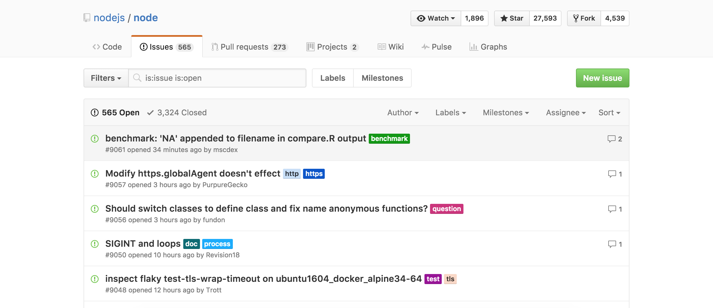

# Como colaborar en una idea: Empieza a escribir código y a aportar ideas a la comunidad

Una vez que te hayas [anotado para trabajar en una idea](#) solo tienes que empezar a colaborar en esta. Todos los repositorios de todas las ideas están en [nuestra organización de Better Code](https://github.com/BetterCodeHQ) de la que tu también eres parte por [haberte registrado](#). En el caso de que no te conste, revisa tu email, **debes de tener una invitación a la organización `BetterCodeHQ`**.

Busca ahí el repositorio de la idea a la que te has anotado, **tiene que llamarse igual que en Better Code pero sin la descripción**, es decir, el nombre antes de los dos puntos en la [vista de detalle del projecto](). También puedes revisar tu email ya que tienes que tener **la confirmación del acceso al repositorio**

## ¿Qué hago una vez que ya estoy en el repositorio?

Cada idea tiene una organización diferente aunque GitHub tiene unas bases que es las que te voy a comentar, **la mayoría de proyectos se basan en estas directrices**

* Nosotros le hemos recomendado a los creadores de ideas que dejaran en el repositorio un `CONTRIBUTING.md`, en ese archivo puedes encontrar directrices sobre cómo contribuir y en qué.

* Consulta los **issues del repositorio**, es una sección en la que el creador de la idea debe de haber dejado tareas pendientes. Como ejemplo te mostramos los issues de el repositorio oficial de Node.JS:

Recuerda que el proyecto puede organizarse de muchas maneras, por ejemplo usando la nueva función de Proyectos de GitHub(algo así como un Trello in-app), nosotros damos las directrices pero los creadores eligen que hacer o no con su espacio. Contacta con ellos para empezar a colaborar si te encuentra algo más confuso. Si sigues experimentando problemas en este sentido no dudes en [contactarnos](#).
