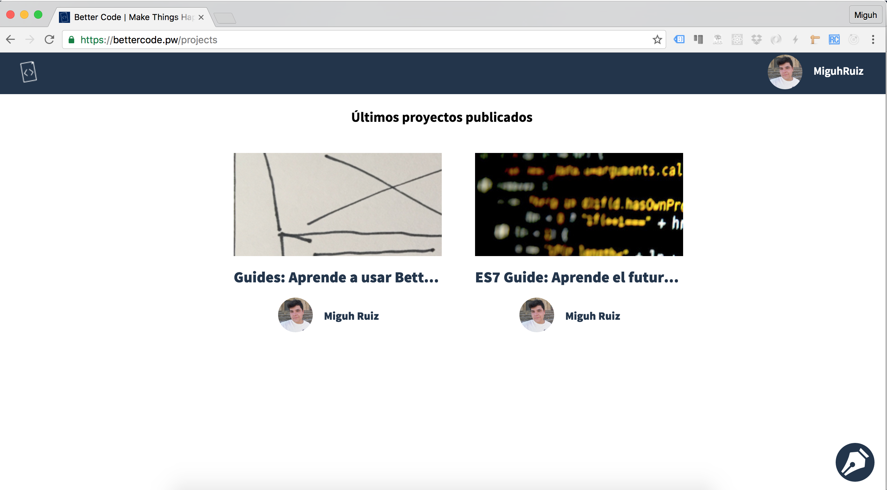
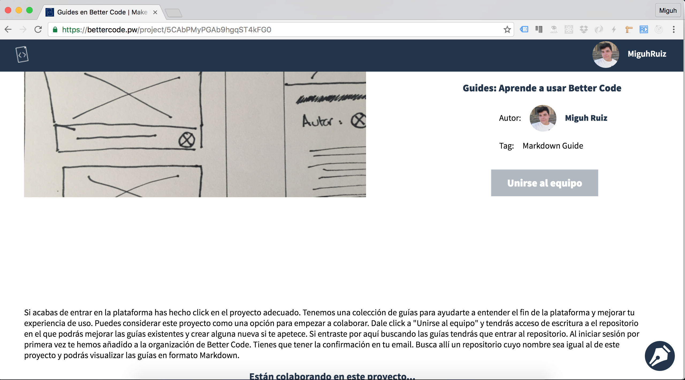
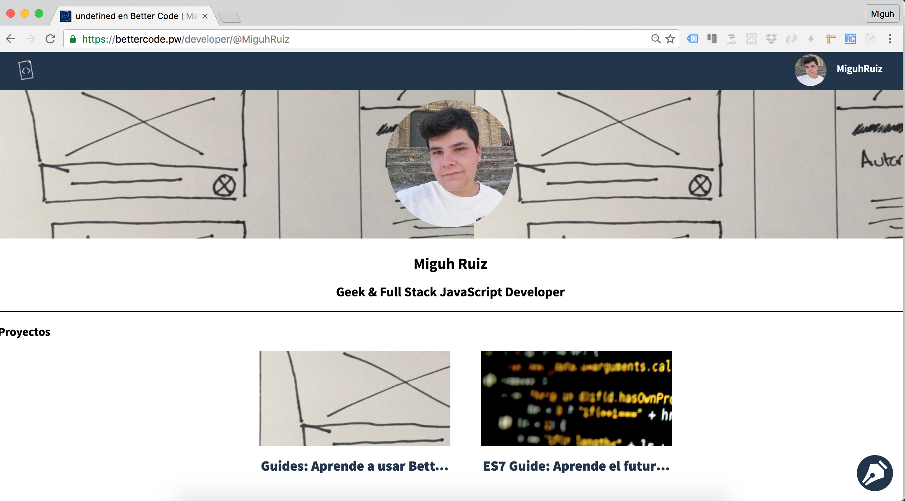

# Un pequeño tour por Better Code: Descubre todas las secciones de la aplicación.

## Sección de proyectos: El corazón de la aplicación.

Una vez que hayas iniciado sesión en la aplicación te encontrarás con la sección de proyectos. En esta puedes ver todas las ideas que la gente hayan creado y acceder a alguna de ellas, lo veremos en la siguiente sección.

---

## Vista de proyecto: Estás a un paso de empezar a colaborar.

Una vez que hayas hecho click en algún proyecto verás detalles sobre este(título, etiqueta, descripción, colaboradores...) e incluso **el botón de la magia** que te convertirá en un colaborador:

---

## Vista de usuario: Aprende más de la comunidad y mira que están haciendo ellos.

Durante estas vistas anteriores, habrás visto que la aplicación te enseña quien creó el proyecto así como un enlace a su perfil(el tuyo también lo tienes, solo tienes que hacer click en tu nombre en la barra de arriba). En los perfiles puedes ver algo más de ellos y saber que ideas han creado:

